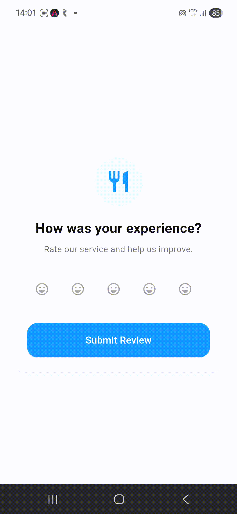

# library_flutter_easyratingbar

A lightweight and customizable Flutter rating bar package that supports tap and swipe rating selection with smooth animations, custom icons, custom colors, and horizontal/vertical layouts.

## When To Use

* **Product Reviews**: Allow users to rate products and services.
* **Feedback Forms**: Collect customer satisfaction ratings.
* **Restaurant Apps**: Let users rate food and dining experiences.
* **Movie & Book Reviews**: Gather ratings for entertainment content.
* **E-commerce Applications**: Display and collect product ratings.
* **Survey Applications**: Provide a simple rating input mechanism.
* **Educational Apps**: Rate courses, lessons, or quizzes.

## Perfect For

* **Product Reviews**
* **Feedback Systems**
* **Restaurant Applications**
* **Survey Forms**
* **E-commerce Apps**
* **Educational Platforms**
* **Customer Satisfaction Tracking**

## Features

| Feature                     | Status    |
| :-------------------------- | :-------- |
| ✅ Tap To Rate               | Supported |
| ✅ Swipe To Rate             | Supported |
| ✅ Horizontal Layout         | Supported |
| ✅ Vertical Layout           | Supported |
| ✅ Custom Icons              | Supported |
| ✅ Custom Colors             | Supported |
| ✅ Animated Rating Selection | Supported |
| ✅ Adjustable Icon Size      | Supported |
| ✅ Custom Animation Duration | Supported |
| ✅ Custom Animation Curves   | Supported |
| ✅ Null Safe                 | Supported |
| ✅ Lightweight               | Supported |
| ✅ Material 3 Compatible     | Supported |

## Parameters

| Parameter           | Type     | Default             | Description                   |
| ------------------- | -------- | ------------------- | ----------------------------- |
| ratingCount         | int      | 5                   | Number of rating icons        |
| selectedIcon        | IconData | Icons.star          | Icon shown when selected      |
| unSelectedIcon      | IconData | Icons.star_border   | Icon shown when unselected    |
| selectedIconColor   | Color?   | null                | Color of selected icons       |
| unSelectedIconColor | Color?   | null                | Color of unselected icons     |
| iconAnimation       | Curve    | Curves.elasticInOut | Animation curve               |
| animationDuration   | Duration | Required            | Animation duration            |
| iconSize            | double   | 20                  | Size of rating icons          |
| horizontalRatingbar | bool     | true                | Horizontal or vertical layout |

## Installation

Add this to your package's `pubspec.yaml` file:

```yaml
dependencies:
  library_flutter_easyratingbar: latest_version
```

OR

```yaml
dependencies:
  library_flutter_easyratingbar:
    git:
      url: https://github.com/Excelsior-Technologies-Community/library_flutter_ratingbar.git
```

Or run:

```bash
flutter pub add library_flutter_easyratingbar
```

## Import

```dart
import 'package:library_flutter_easyratingbar/ratingbar/ratingbar.dart';
```

## Usage Examples

### Basic Rating Bar

```dart
Ratingbar(
  animationDuration: Duration(milliseconds: 500),
)
```

### Star Rating Bar

```dart
Ratingbar(
  animationDuration: Duration(milliseconds: 500),
  selectedIcon: Icons.star,
  unSelectedIcon: Icons.star_border,
  selectedIconColor: Colors.amber,
  unSelectedIconColor: Colors.grey,
)
```

### Emoji Rating Bar

```dart
Ratingbar(
  animationDuration: Duration(seconds: 1),
  iconSize: 30,
  selectedIcon: Icons.emoji_emotions,
  unSelectedIcon: Icons.emoji_emotions_outlined,
  selectedIconColor: Colors.orange,
  unSelectedIconColor: Colors.grey,
  ratingCount: 5,
  iconAnimation: Curves.elasticOut,
)
```

### Heart Rating Bar

```dart
Ratingbar(
  animationDuration: Duration(milliseconds: 400),
  selectedIcon: Icons.favorite,
  unSelectedIcon: Icons.favorite_border,
  selectedIconColor: Colors.red,
  unSelectedIconColor: Colors.grey,
)
```

### Vertical Rating Bar

```dart
Ratingbar(
  animationDuration: Duration(milliseconds: 500),
  horizontalRatingbar: false,
  selectedIcon: Icons.star,
  unSelectedIcon: Icons.star_border,
)
```

## Full Example

```dart
import 'package:flutter/material.dart';
import 'package:library_flutter_easyratingbar/ratingbar/ratingbar.dart';

void main() {
  runApp(const MyApp());
}

class MyApp extends StatelessWidget {
  const MyApp({super.key});

  @override
  Widget build(BuildContext context) {
    return MaterialApp(
      debugShowCheckedModeBanner: false,
      home: Scaffold(
        appBar: AppBar(
          title: const Text('Easy Rating Bar Demo'),
          centerTitle: true,
        ),
        body: Center(
          child: Ratingbar(
            animationDuration: const Duration(seconds: 1),
            iconSize: 30,
            selectedIcon: Icons.emoji_emotions,
            unSelectedIcon: Icons.emoji_emotions_outlined,
            selectedIconColor: Colors.orange,
            unSelectedIconColor: Colors.grey,
            ratingCount: 5,
            horizontalRatingbar: true,
            iconAnimation: Curves.elasticOut,
          ),
        ),
      ),
    );
  }
}
```

## Swipe Rating Support

Users can select ratings by simply dragging across the icons.

```text
⭐☆☆☆☆
⭐⭐☆☆☆
⭐⭐⭐☆☆
⭐⭐⭐⭐☆
⭐⭐⭐⭐⭐
```

## Demo
Tap Rating & Swipe Rating
```html



```


## License

MIT License

Copyright (c) 2026 Excelsior Technologies

Permission is hereby granted, free of charge, to any person obtaining a copy
of this software and associated documentation files (the "Software"), to deal
in the Software without restriction, including without limitation the rights
to use, copy, modify, merge, publish, distribute, sublicense, and/or sell
copies of the Software, and to permit persons to whom the Software is
furnished to do so, subject to the following conditions:
The above copyright notice and this permission notice shall be included in all
copies or substantial portions of the Software.
THE SOFTWARE IS PROVIDED "AS IS", WITHOUT WARRANTY OF ANY KIND, EXPRESS OR
IMPLIED, INCLUDING BUT NOT LIMITED TO THE WARRANTIES OF MERCHANTABILITY,
FITNESS FOR A PARTICULAR PURPOSE AND NONINFRINGEMENT. IN NO EVENT SHALL THE
AUTHORS OR COPYRIGHT HOLDERS BE LIABLE FOR ANY CLAIM, DAMAGES OR OTHER
LIABILITY, WHETHER IN AN ACTION OF CONTRACT, TORT OR OTHERWISE, ARISING FROM,
OUT OF OR IN CONNECTION WITH THE SOFTWARE OR THE USE OR OTHER DEALINGS IN THE
SOFTWARE.
 